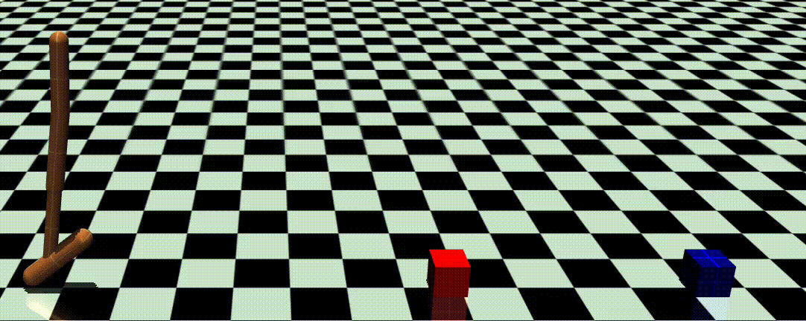

# Hopper Sim-to-Real and Residual Policy Project

This project explores **sim-to-real transfer** and **residual policy learning** using the MuJoCo *Hopper* environment.

I first trained a **base policy** with **Proximal Policy Optimization (PPO)** for stable locomotion in the standard Hopper environment. Then, I applied **Domain Randomization** (varying physics parameters such as mass, friction, and damping) to test how well the learned policy generalizes — simulating the sim-to-real gap often encountered when transferring policies from simulation to real robots.

Finally, I introduced **obstacles** to the Hopper environment and trained a **residual policy** on top of the pre-trained PPO model. The residual policy learns small corrective actions that enable the hopper to successfully **jump over obstacles** without retraining the entire base policy.

### Example Results

